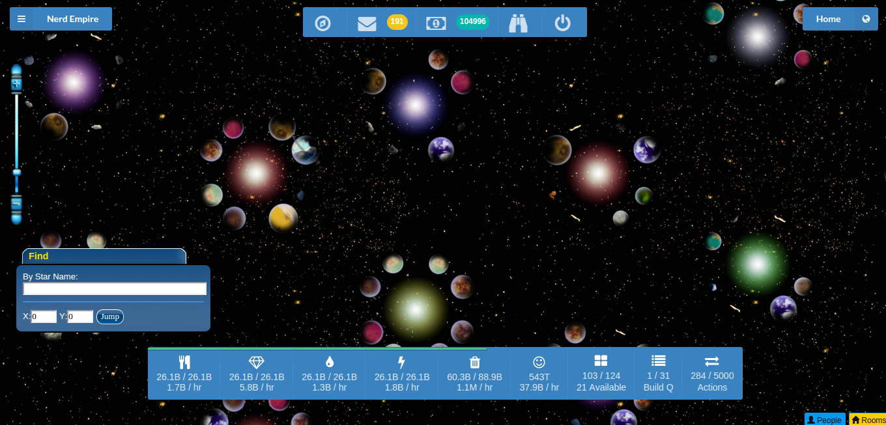

# Top Ideas
```
https://github.com/communityus/proton-native
https://github.com/communityus/react-native-desktop
```

# Lacuna Web Client [](https://waffle.io/plainblack/lacuna-web-client)

>  Web Client for the [open source](http://www.lacunaexpanse.com/developers) game [The Lacuna Expanse](http://www.lacunaexpanse.com/).



# Ideas

Got an idea? [Let us know!](https://github.com/plainblack/Lacuna-Web-Client/issues)

[](https://github.com/plainblack/Lacuna-Web-Client/issues)

# Hacking

If you're interested in hacking on the client, hit up the [developer's documentation](docs/README.md).

# License

See the [license file](LICENSE).


# ToDo
angular app executable
https://angularfirebase.com/lessons/desktop-apps-with-electron-and-angular/
https://angular.io/cli

-build
Angular app
https://update.angular.io/#7.0:8.0


deploy
d 
Invokes the deploy builder for a specified project. If no project is specified, the CLI will invoke the deploy builder for the default project in the workspace.

# more
https://alternativeto.net/software/electron/

You wouldn't be the first to use Electron for desktop and React Native for mobile, if you choose that route - that's exactly what Discord did, and it seems to have turned out okay for them.
https://stackoverflow.com/questions/48152008/can-you-use-react-native-to-create-a-desktop-app

- one way (also mentioned above but diff approach)
https://www.microsoft.com/developerblog/2016/05/26/creating-universal-windows-apps-with-react-native/

# c# react electron
https://github.com/communityus/electron-demo
Copy C# folder “core” into “release-builds\electron-demo-win32-ia32” and run the electron-demo.exe

# desktop (all?) linux
https://www.npmjs.com/package/nativefier
https://github.com/status-im/react-native-desktop
https://github.com/kusti8/proton-native

#mac
https://github.com/ptmt/react-native-macos

#win
https://github.com/Microsoft/react-native-windows
http://facebook.github.io/react-native/


#ruby and nodejs
http://enclose.io/

#rails
https://github.com/bp-tags/rails-in-electron
